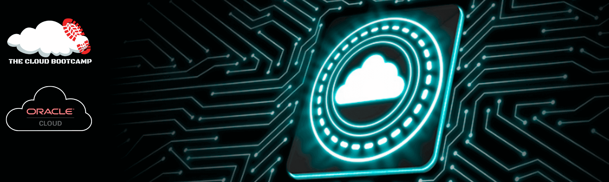

 
 
 

  

# Oracle Cloud Infrastructure (OCI)
*Projects using Oracle Cloud Infrastructure*
  
Institution: **The Cloud Bootcamp**

Training: Bootcamp Oracle Cloud Infrastructure - **hands-on** specialization program focusing on **Oracle Cloud Infrastructure** **(OCI)** and **Cloud Computing**.
 Total duration: 55h

As part of this program, I had the opportunity to acquire knowledge of the fundamentals of Oracle Cloud Infrastructure (OCI) and Cloud Computing, in addition to implementing **mini-projects** based on **real-world scenarios**, such as:

1. Implementation of users, groups and policies in a 100% automated way using Ansible and Cloud Shell.
2. Implementation of network communication control on Oracle Cloud Infrastructure with Virtual Cloud Network (VCN), distinct subnets and security lists with specific rules for each subnet.
3. Infrastructure as code + Pipeline: Implementation of network and compute resources on Oracle Cloud Infrastructure in a 100% automated way using Github, Terraform Cloud and Terraform IAC.
4. Implementation of video cloudbackup application (Web) integrated with Oracle Cloud Infrastructure Python SDK to upload videos in a private bucket of Object Storage, and Instance Principals with Dynamic Groups for authentication and Authorization of API completely "Keyless".
5. Conversion of vacation control spreadsheet into Web Mobile-Responsive and 100% Serverless application using Oracle Autonomous Database (Data Layer) and Oracle Application Express (App Layer) integrated with Oracle Cloud Infrastructure e-mail delivery service in less than 2 hours.
6. Final Project: Migration and modernization of HR management application and Oracle Database from on-premises environment to MultiCloud architecture: Microsoft Azure App Service (Serverless Docker-Based Managed Service) and Oracle Autonomous Database (Serverless Database).

